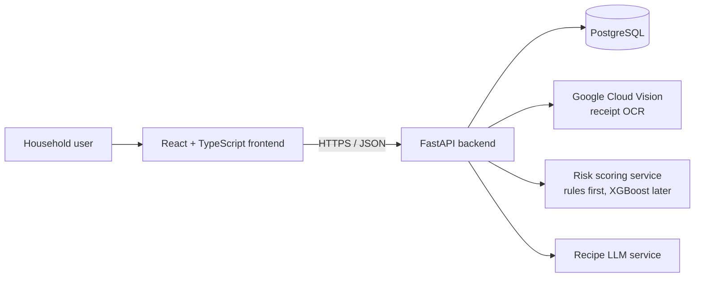
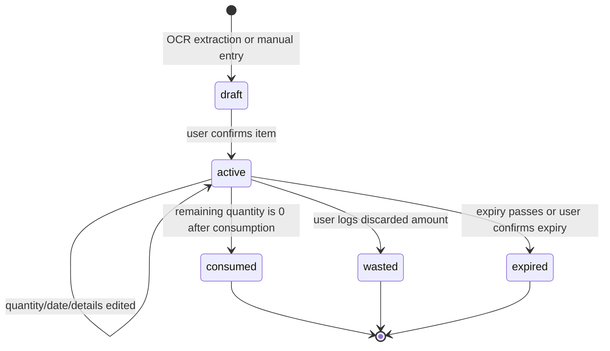

# WasteWise AI - Project Plan

## 1. Project goal

Build a web application that helps households reduce food waste. Users add groceries from receipts or manually, maintain a pantry, receive expiry reminders and waste-risk predictions, and get useful shopping and recipe recommendations.

## 2. Product scope

### Target users

Start with households and individual grocery shoppers. Restaurants, grocery chains, and government analytics are future expansion opportunities, not part of the first release.

### MVP features

1. **Accounts and household profiles** - Sign up, sign in, and create a household profile.
2. **Receipt import** - Upload a grocery receipt, run OCR, show extracted items for user review, then save approved items.
3. **Smart pantry** - View, add, edit, and consume pantry items with quantity, unit, purchase date, expiry date, category, and storage location.
4. **Updates and corrections** - Edit OCR-extracted receipt items before confirmation, update pantry quantities and dates after confirmation, correct product/category details, and undo accidental inventory actions. Every update is recorded in inventory history for accuracy and model learning.
5. **Expiry tracking** - Show items expiring soon and notify users before expiry.
6. **Waste logging** - Mark an item or remaining quantity as consumed, discarded, or expired. This creates the learning data for future predictions.
7. **Waste-risk score** - Rank pantry items by likelihood of going to waste, with an understandable reason such as “expires in 2 days” or “consumption is slower than usual.”
8. **Grocery recommendations** - Suggest what to buy, avoid duplicate purchases, and flag items already sufficiently stocked.
9. **Recipe suggestions** - Generate recipes that prioritize ingredients approaching expiry.
10. **Dashboard** - Display pantry health, upcoming expiries, waste-risk items, monthly spend, and food-waste trends.

### Deferred from MVP

- Restaurant workflows and multi-location inventory
- Grocery-chain demand forecasting
- Government or city-wide reporting
- Fully automatic receipt extraction with no user review
- Native mobile applications
- Advanced personalization before sufficient household history exists

## 3. Technology decisions

| Area | Choice | Purpose |
|---|---|---|
| Frontend | React + TypeScript | Responsive dashboard and forms |
| Backend | FastAPI + Python | API, business rules, and ML integration |
| Database | PostgreSQL | Users, pantry, purchases, events, and predictions |
| OCR | Google Cloud Vision API | Receipt text extraction |
| Prediction | XGBoost | Initial structured waste-risk model |
| Charts | Chart.js | Spending, waste, and pantry-health trends |
| Recipe AI | LLM API | Recipe recommendations from pantry ingredients |

Use a service abstraction for OCR and recipe generation so providers can be swapped later. Keep all API keys in environment variables; never commit them.

## 4. Architecture



### Backend responsibilities

- FastAPI owns validation, authentication, authorization, business rules, and all database access.
- React never talks directly to PostgreSQL, OCR, ML, or the recipe provider.
- OCR and recipe providers are accessed through backend adapters so their implementations can change without changing the frontend.
- The prediction service returns a score and reasons; the API saves the prediction with its model/rules version.

### Authentication and access control

- Use bearer-token authentication for the MVP.
- Every household-owned query must filter by the authenticated user's household membership.
- A user can only view and modify their own household's receipts, pantry items, events, predictions, and recommendations.

## 5. Core user journeys

### A. Add groceries from a receipt

1. User uploads a receipt image or PDF.
2. Backend sends it to the OCR provider.
3. Backend parses candidate item names, quantities, prices, and purchase date.
4. User reviews and corrects the extracted data, including expiry dates when unknown.
5. Approved items are saved to the pantry and purchase history.

### B. Manage food before it goes to waste

1. User opens the dashboard.
2. The app highlights items that expire soon or carry high waste risk.
3. User chooses to consume, discard, adjust quantity, or request a recipe.
4. The app records the outcome and updates future recommendations.

### C. Prepare to shop

1. User opens the grocery recommendation view.
2. The app considers pantry stock, recent purchases, consumption rate, and planned replenishment.
3. The user receives a suggested list and warnings about duplicate or low-need items.

### D. Rescue Mode (key differentiator)

1. The dashboard calculates the highest-priority items that are nearing expiry or have elevated waste risk.
2. It presents one clear action: use these items in a recipe, consume them soon, or avoid repurchasing an item already in stock.
3. It shows an estimated value at risk when price data exists and always explains the recommendation.

Example: "You have 3 items at risk in the next 48 hours. Use milk, bread, and spinach in this recipe. Do not buy milk: 1 litre remains in your pantry."

## 6. Data model (initial)

| Entity | Key fields |
|---|---|
| `users` | id, email, password_hash, name |
| `households` | id, name, timezone |
| `household_members` | household_id, user_id, role |
| `products` | id, normalized_name, category, default_unit, shelf_life_days |
| `receipts` | id, household_id, image_url, purchased_at, ocr_status, raw_ocr_text |
| `receipt_items` | id, receipt_id, product_id, raw_name, quantity, unit, price |
| `pantry_items` | id, household_id, product_id, quantity_initial, quantity_remaining, unit, purchased_at, expires_at, status |
| `inventory_events` | id, pantry_item_id, event_type, quantity, occurred_at, notes, previous_values |
| `waste_predictions` | id, pantry_item_id, risk_score, risk_band, explanation, model_version, generated_at |
| `recipe_recommendations` | id, household_id, pantry_item_ids, prompt_version, recipe_data, generated_at |

`inventory_events` is essential: it captures consumption and waste outcomes used to learn household behavior and train the prediction model.

## 7. Data lifecycle and business rules

### Pantry item lifecycle



### Rules that protect data quality

- Receipt OCR output is always `draft`; it cannot enter the pantry until the user reviews and confirms it.
- `quantity_remaining` cannot be negative or greater than `quantity_initial` unless an explicit inventory adjustment is recorded.
- Editing a quantity, purchase date, expiry date, category, or storage location updates the pantry item and writes an `inventory_events` audit record containing previous values.
- Consuming, discarding, expiring, or adjusting an item creates an event; an accidental event can be undone by creating a compensating event rather than deleting history.
- Waste-model labels are created only when an item has a recorded `wasted` or `expired` outcome with remaining quantity.
- Expiry dates entered by users are authoritative; category-based shelf-life dates are clearly marked as estimates.

## 8. API design and data contracts

### API conventions

- Base path: `/api/v1`
- Content type: `application/json`, except receipt upload which uses `multipart/form-data`.
- All protected endpoints require `Authorization: Bearer <token>`.
- Dates use ISO 8601 UTC timestamps; date-only fields such as expiry use `YYYY-MM-DD`.
- Money uses a decimal number plus ISO currency code, for example `{"amount": 450.00, "currency": "PKR"}`.
- All IDs are UUID strings.

### Standard error response

```json
{
  "error": {
    "code": "VALIDATION_ERROR",
    "message": "expiry_date must be on or after purchase_date",
    "fields": {
      "expiry_date": "Must be on or after purchase_date"
    }
  }
}
```

Expected HTTP statuses: `200` success, `201` created, `204` deleted, `400` invalid request, `401` unauthenticated, `403` wrong household, `404` not found, `422` validation error, `500` unexpected server error.

### Core contracts

#### Create or manually add a pantry item

`POST /api/v1/pantry-items`

```json
{
  "product_name": "Milk",
  "category": "Dairy",
  "quantity": 1.0,
  "unit": "litre",
  "purchase_date": "2026-07-16",
  "expiry_date": "2026-07-20",
  "storage_location": "Fridge",
  "price": { "amount": 320.00, "currency": "PKR" }
}
```

Validation: `product_name`, positive `quantity`, `unit`, and `purchase_date` are required. `expiry_date` is optional but cannot be earlier than `purchase_date`.

```json
{
  "id": "d0b5b57c-0a0b-4b8c-bb90-a4b70708aee9",
  "product_name": "Milk",
  "category": "Dairy",
  "quantity_initial": 1.0,
  "quantity_remaining": 1.0,
  "unit": "litre",
  "purchase_date": "2026-07-16",
  "expiry_date": "2026-07-20",
  "storage_location": "Fridge",
  "status": "active"
}
```

#### Update a pantry item

`PATCH /api/v1/pantry-items/{pantry_item_id}`

```json
{
  "quantity_remaining": 0.5,
  "expiry_date": "2026-07-21",
  "storage_location": "Fridge"
}
```

Only supplied fields change. The API creates an audit event when a tracked field changes.

#### Record consumption, waste, or adjustment

`POST /api/v1/pantry-items/{pantry_item_id}/events`

```json
{
  "event_type": "consumed",
  "quantity": 0.5,
  "occurred_at": "2026-07-17T18:30:00Z",
  "notes": "Used in tea"
}
```

Allowed event types: `consumed`, `wasted`, `expired`, `adjusted`. The API validates that the quantity does not exceed the remaining quantity, except for authorised `adjusted` events.

#### Upload and confirm a receipt

`POST /api/v1/receipts` accepts a `file` field. It returns `201` with a receipt in `processing` status; the frontend polls `GET /api/v1/receipts/{receipt_id}` until it is `ready_for_review`.

```json
{
  "id": "510c3f2b-cc78-45e9-9364-a5f8c5baf0ce",
  "status": "ready_for_review",
  "purchase_date": "2026-07-16",
  "items": [
    {
      "id": "6bf8eec7-f3c5-4e13-a5ef-c5a00d3b4fa3",
      "raw_name": "MILK 1L",
      "product_name": "Milk",
      "quantity": 1.0,
      "unit": "litre",
      "price": { "amount": 320.00, "currency": "PKR" },
      "confidence": 0.91
    }
  ]
}
```

The user may edit an extracted line with `PATCH /api/v1/receipts/{receipt_id}/items/{item_id}`. `POST /api/v1/receipts/{receipt_id}/confirm` accepts approved items and creates active pantry items.

#### Get Rescue Mode

`GET /api/v1/dashboard/rescue-mode`

```json
{
  "summary": "3 items need attention in the next 48 hours",
  "estimated_value_at_risk": { "amount": 850.00, "currency": "PKR" },
  "items": [
    {
      "pantry_item_id": "d0b5b57c-0a0b-4b8c-bb90-a4b70708aee9",
      "product_name": "Milk",
      "risk_score": 0.82,
      "risk_band": "high",
      "reasons": ["Expires in 2 days", "Consumption is slower than usual"]
    }
  ],
  "actions": [
    {
      "type": "recipe",
      "title": "Use milk, bread, and spinach tonight",
      "reason": "Uses three high-priority pantry items"
    },
    {
      "type": "avoid_purchase",
      "product_name": "Milk",
      "reason": "1 litre remains in your pantry"
    }
  ]
}
```

## 9. API outline

| Area | Initial endpoints |
|---|---|
| Authentication | `POST /auth/register`, `POST /auth/login`, `GET /auth/me` |
| Pantry | `GET/POST /pantry-items`, `GET/PATCH/DELETE /pantry-items/{id}` |
| Pantry events | `POST /pantry-items/{id}/events`, `POST /pantry-items/{id}/events/{event_id}/undo` |
| Receipts | `POST /receipts`, `GET/PATCH /receipts/{id}`, `PATCH /receipts/{id}/items/{item_id}`, `POST /receipts/{id}/confirm` |
| Dashboard | `GET /dashboard/summary` |
| Predictions | `GET /predictions/waste-risk` |
| Recommendations | `GET /recommendations/grocery`, `POST /recommendations/recipes` |

## 10. Delivery phases

### Phase 0 - Define contracts and set up

- Confirm MVP assumptions, success metrics, and primary user personas.
- Create React and FastAPI applications, PostgreSQL database, environment configuration, linting, and test foundations.
- Implement the database migrations, API conventions, error handling, authentication approach, and the contracts in this plan before building UI screens.

**Done when:** a developer can run the frontend, backend, and database locally; a test user can authenticate; and the API contracts are implemented and testable in Swagger/OpenAPI.

### Phase 1 - Pantry foundation

- Implement accounts and household isolation.
- Build product catalog and manual pantry-item CRUD, including form validation and clear update/delete confirmation.
- Record consumed, discarded, expired, and quantity-adjustment events, with an undo option and audit history.
- Build a simple dashboard for pantry count and expiring items.

**Done when:** a user can add, edit, delete, consume, discard, and undo an accidental item event; no user can access another household's data.

### Phase 2 - Receipt ingestion

- Integrate Google Vision through a backend OCR adapter.
- Parse and normalize receipt lines into reviewable candidate items.
- Create the receipt review UI and persist confirmed items.
- Add test fixtures for common receipt formats and error states.

**Done when:** a user can upload a receipt, correct every OCR line, confirm it, and see its groceries in the pantry without duplicate items.

### Phase 3 - Rules-based intelligence

- Implement expiry alerts and a transparent baseline risk score.
- Implement duplicate-stock checks and simple grocery recommendations.
- Add recipe recommendations using soon-to-expire pantry items.
- Build Rescue Mode with reasoned actions and estimated value at risk.
- Display reasons behind every recommendation.

**Done when:** a new household receives an expiry-based rescue action and a grocery warning; each recommendation visibly states why it was made.

### Phase 4 - ML waste prediction

- Define labels: an item is “wasted” when it is logged as discarded/expired with remaining quantity.
- Create features from expiry proximity, quantity remaining, purchase frequency, category, household consumption history, and past waste rate.
- Build an offline training pipeline with food-waste, grocery, and retail-consumption datasets plus anonymized product data.
- Evaluate XGBoost against a rules baseline using precision, recall, and calibration; avoid presenting uncertain predictions as facts.
- Deploy model versioning, scheduled scoring, explanations, and monitoring for drift and data quality.

**Done when:** the model demonstrably improves on the baseline and each score includes a clear explanation.

### Phase 5 - Quality, privacy, and launch

- Add unit, API, and end-to-end tests for critical paths.
- Add accessibility, responsive layout, loading, retry, and empty states.
- Add secure secret management, authorization checks, audit logging, deletion/export support, and data-retention rules.
- Instrument activation, pantry updates, waste logging, and recommendation usage.
- Run a small household pilot and iterate based on observed accuracy and usability.

**Done when:** the MVP is secure, measurable, tested, and usable by pilot households.

## 11. ML approach and guardrails

Start with rules, then personalize only when data supports it. A practical staged score is:

- **Cold start:** expiry date, product category, and quantity remaining.
- **Early personalization:** household purchase cadence and logged consumption.
- **Mature model:** XGBoost trained on aggregated historical features and outcome labels.

Important safeguards:

- Never silently change pantry quantities based on a prediction.
- Show the factors influencing a risk score.
- Let users correct product names, categories, quantities, expiry dates, and outcomes.
- Separate personally identifiable account data from model-training exports.
- Track model version and prediction date for every score.

## 12. Success metrics

| Metric | MVP target / use |
|---|---|
| Receipt confirmation rate | Measures OCR usefulness and review friction |
| Pantry update frequency | Measures whether the inventory stays current |
| Waste logged per household | Baseline for measuring reduction over time |
| Items consumed before expiry | Primary behavior outcome |
| Grocery recommendations accepted | Measures recommendation relevance |
| Waste-risk precision | Measures whether high-risk flags are trustworthy |
| Monthly food spend and waste trend | Communicates household value |

## 13. Key risks and mitigations

| Risk | Mitigation |
|---|---|
| Receipt OCR is inaccurate | Require user review; store raw text and confidence; maintain product-name normalization rules. |
| Expiry dates are missing from receipts | Let users set dates; suggest defaults by category and clearly label them as estimates. |
| Little data for ML | Deliver transparent rules first and use public datasets only for initial experimentation. |
| Users stop updating the pantry | Keep updates quick, provide reminders, and make receipt import the default entry point. |
| Prediction lacks trust | Show explanations, confidence, and a way to correct outcomes. |
| Sensitive household data | Apply least-privilege access, encryption in transit, and retention/deletion controls. |

## 14. Monday demo scope and recommended build order

### Monday demo must work end to end

1. Sign in as a demo household.
2. Upload one prepared sample receipt.
3. Review and edit at least one OCR-extracted item.
4. Confirm the receipt and show the resulting active pantry items.
5. Edit a pantry item's quantity or expiry date, then show its event history.
6. Open Rescue Mode and show at least one risk explanation, an avoid-purchase suggestion, and a recipe suggestion.
7. Mark an item consumed or wasted and show the dashboard updating.

Use seeded sample data if external OCR or recipe keys are unavailable. The demo must clearly label mocked provider responses; do not pretend a mock is live AI.

### Recommended build order

1. Repository setup, authentication, database schema, and local development environment.
2. Implement and test the API contracts for pantry items and inventory events in Swagger/OpenAPI.
3. Manual pantry management, edits, and inventory-event logging.
4. Dashboard, expiry-based alerts, and Rescue Mode rules.
5. Receipt OCR with review and confirmation.
6. Rules-based grocery and recipe recommendations.
7. Analytics, tests, privacy controls, and pilot feedback.
8. Train, validate, and introduce the XGBoost risk model.

This order ensures the product creates reliable pantry and outcome data before it relies on machine learning.
